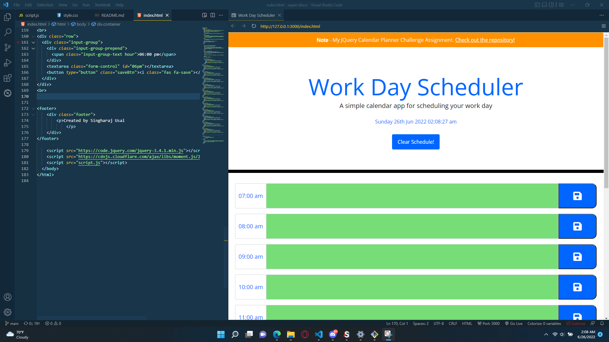
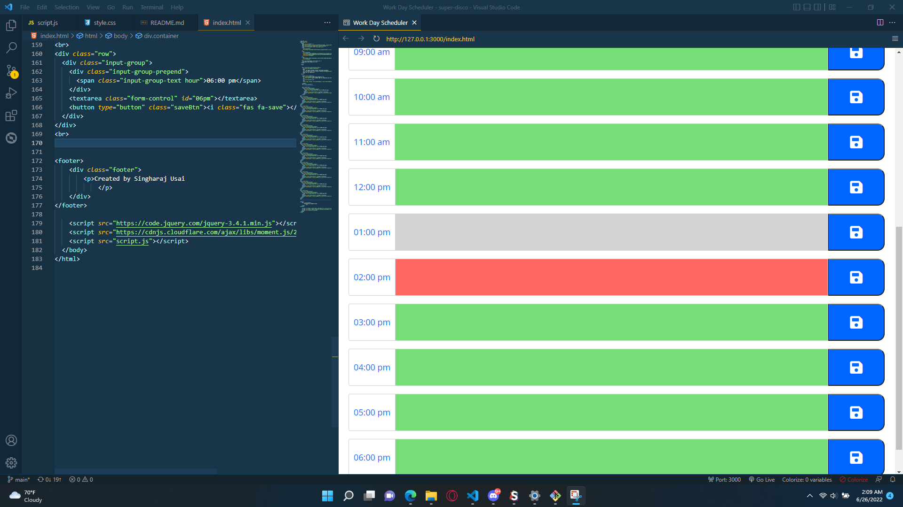

# Singharaj's Work Day Scheduler

## Index
1. [Overview](#overview)
    - [Summary](#summary)
    - [Links](#links)
    - [User Story](#user-story)
    - [Acceptance Criteria](#acceptance-criteria)
    - [Screenshots](#screenshots)
    - [Made with](#made-with)

# Overview

## Something broke the timetable color codes, I'll be looking at what happened...
Create a calendar scheduler that can be saved using Moment JS or other alternatives since MomentJS is a legacy project.

## Summary

This week's challenge will be a simple calendar that users can save events for each hour of the day.

## Links

Live Site URL: https://singharaj-usai.github.io/Work-Day-Scheduler/

Repository URL: https://github.com/singharaj-usai/Work-Day-Scheduler

## User Story
````
- AS AN employee with a busy schedule
- I WANT to add important events to a daily planner
- SO THAT I can manage my time effectively
````
## Acceptance Criteria
````
- GIVEN I am using a daily planner to create a schedule
- WHEN I open the planner
- THEN the current day is displayed at the top of the calendar
- WHEN I scroll down
- THEN I am presented with time blocks for standard business hours
- WHEN I view the time blocks for that day
- THEN each time block is color-coded to indicate whether it is in the past, present, or future
- WHEN I click into a time block
- THEN I can enter an event
- WHEN I click the save button for that time block
- THEN the text for that event is saved in local storage
- WHEN I refresh the page
- THEN the saved events persist
````
## Screenshots
* Work Day Scheduler
    * Planner with time tables color coded


* Color Coded Time Blocks
    * Time tables are color coded for the present, past or future hours


* Interactable Time Tables
    * Time blocks can be typed in for a schedule planner and saveable, with a clear schedule button to remove filled in texts.


## Made With

* HTML5
* CSS
* Powered by JQuery Moment Javascript
* Javascript
